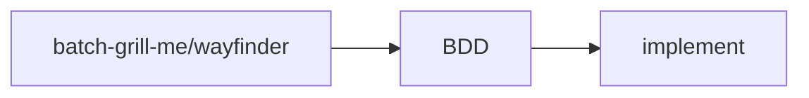

# AI Engineering Guide

> 面向 AI 研发平台与 Codex 等 AI 编码助手的工程规范与技能知识库。
> 沉淀研发全流程的领域规范，让 AI 编码助手在执行任务时“有章可循、越用越准”。

本仓库不是可运行的应用，而是一套**规范 + 技能**的集合：

- **工程规范（`rules/`）**：后端、前端的架构与开发规约，作为 AI 编码助手必须遵守的约束。
- **技能（`skills/`）**：覆盖需求、规格、实现、测试、数据库、设计等环节的可调用技能。
- **设计系统（`DESIGN.md`）**：前端视觉与组件的唯一事实来源。
- **入口指令（`AGENTS.md`）**：AI 编码助手加载本仓库时的总入口，按需懒加载各规范文档。

---

## 仓库结构

```
.
├── AGENTS.md              # AI 编码助手主入口指令（指向各规范文档）
├── DESIGN.md              # 前端统一设计系统（source of truth）
├── rules/                 # 工程规范文档
│   ├── backend-*.md       # 后端规范（13 篇）
│   └── frontend-*.md      # 前端规范（3 篇）
└── skills/                # 技能（每个子目录一份技能）
```

---

## 工程规范（rules）

### 后端

| 文档 | 说明 |
| ---- | ---- |
| `backend-architecture.md` | DDD 分层架构规范 |
| `backend-api-design.md` | API 设计规范 |
| `backend-code-style.md` | 后端代码风格规范 |
| `backend-database-change-governance.md` | 数据库变更治理规范 |
| `backend-database-modeling-and-access.md` | 数据库建模与访问规范 |
| `backend-database-multi-db-compatibility.md` | 数据库选型与多库兼容规范 |
| `backend-domain-event.md` | 领域事件开发规范 |
| `backend-exception-handling.md` | 异常处理规范 |
| `backend-id-generation.md` | ID 生成规范 |
| `backend-log-observability.md` | 日志与可观测性规范 |
| `backend-security.md` | 后端安全规范 |
| `backend-specification-pattern.md` | 规约模式规范 |
| `backend-tenant-context.md` | 租户上下文规范 |

### 前端

| 文档 | 说明 |
| ---- | ---- |
| `frontend-architecture.md` | 前端架构规范 |
| `frontend-code-style.md` | 前端代码风格规范 |
| `frontend-ui-style.md` | 前端 UI 样式规范 |

---

## 技能（skills）

按研发阶段分组：

**规划与需求**

- `wayfinder` - 将超出单次会话的大型工作规划为决策工单地图，逐个消解直到路径清晰。
- `batch-grill-me` - 分轮次系统性提问，以设计树梳理需求决策。
- `research` - 后台研究代理，基于一手资料调研并沉淀 Markdown 笔记。

**规格与行为**

- `bdd` - 从用户需求描述生成 BDD `.feature` 文件（按命令组织）。
- `gherkin` - 创建与管理 Gherkin/Cucumber 行为规格。

**实现与测试**

- `implement` - 基于 BDD feature 实现工作项，配合 TDD 与 ui-ux-pro-max。
- `tdd` - 测试驱动开发参考（红-绿-重构循环）。
- `diagnose` - 复杂 bug 与性能回归的诊断循环。

**架构与重构**

- `improve-codebase-architecture` - 扫描架构深化机会并产出可视化 HTML 报告。

**数据库**

- `db-release-consolidation` - 发版前折叠未发布的 Liquibase 中间脚本为目标态 changelog。

**设计**

- `ui-ux-pro-max` - UI/UX 设计智能数据库，含样式、配色、字体、UX 指南与多技术栈建议。

**元技能**

- `writing-great-skills` - 编写高质量技能的词汇与原则参考。

---

## AI 开发流程

> 定义从需求到代码的三阶段流程，让团队与 AI 协同把需求快速落地为可验收、可实现的代码。

### 1. 流程总览



阶段顺序要点：

- 先澄清、后编码：需求与决策不明确不进入实现。
- 全员参与决策：batch-grill-me/wayfinder 与 BDD 阶段鼓励大家一起讨论与决策。
- 一次性实现：implement 阶段整功能产出全部代码，避免逐接口反复调用技能。

### 2. 阶段说明

#### 阶段1：batch-grill-me/wayfinder

**说明**
- 批量澄清需求，大家一起参与决策。
- 简单需求用 batch-grill-me 直接澄清；复杂需求（超出单次会话容量、路径不清晰）用 wayfinder 辅助。

**batch-grill-me 技能说明**
- 定位：一轮接一轮的密集访谈，一次性提出当前所有可决策的问题，直到达成共识。
- 核心理念：把需求建模为“设计树”（design tree），按轮次推进--每轮只问前置决策已确定的前沿问题，编号并给出推荐答案，等用户回答后重塑决策树、推进前沿。
- 职责分工：查事实由 AI 派子代理完成，做决策由用户拍板。
- 完成标志：前沿为空（所有分支已遍历、无隐含假设），且用户确认达成共识后才开始行动。

**wayfinder 技能说明**
- 定位：为大型、模糊的工作块绘制“决策地图”，在 issue tracker 上以决策票（ticket）形式逐个推进，直到通往目标的路径清晰。
- 核心理念：规划而非执行（plan, don't do）--每个决策票只解决一个决策，地图完成即代表无需再决策、可以交接执行。
- 关键产物：`wayfinder:map`（索引型主 issue）及其子决策票（research / prototype / grilling / task 四类）。
- 调用模式：先 chart the map（绘制地图）定方向，再 work through the map（逐票推进）做决策。

**输出**
- 决策结论
- 需求基线

#### 阶段2：BDD

**说明**
- 基于需求基线生成用户故事，大家一起讨论完善。

**输出**
- 用户故事
- 业务规则
- 验收条件

#### 阶段3：implement

**说明**
- 基于用户故事、业务规则与验收条件实现全部代码。
- 各岗位找对应 AI 产物进行 review。

**输出**
- 领域层
- 应用层
- 契约层
- 基础设施层

### 3. 执行原则

- 先决策、后实现：需求基线与验收条件明确后再编码。
- 全员参与：澄清与 BDD 阶段鼓励团队共同讨论与决策。
- 一次性产出：implement 阶段整功能实现，避免逐接口反复调用技能。
- AI 产物可 review：各阶段 AI 产出的文档与代码均可由对应岗位审查。
---

## 如何使用

### 作为 AI 编码助手的规范来源和技能库

将本仓库（或其中的 `AGENTS.md`、`rules/`、`DESIGN.md`）置于工作区中。AI 编码助手（如 Codex）会读取 `AGENTS.md` 作为总入口，并在处理具体任务时按需懒加载相关规范，将其视为必须遵守的约束。

`skills/` 下每个子目录是一个标准的技能（含 `SKILL.md` 与 `agents/openai.yaml`）。可通过 AI 编码助手在会话中调用。

---
